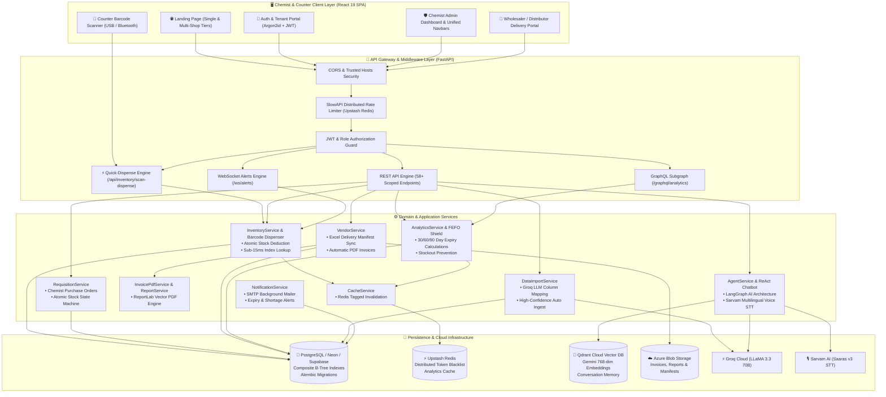
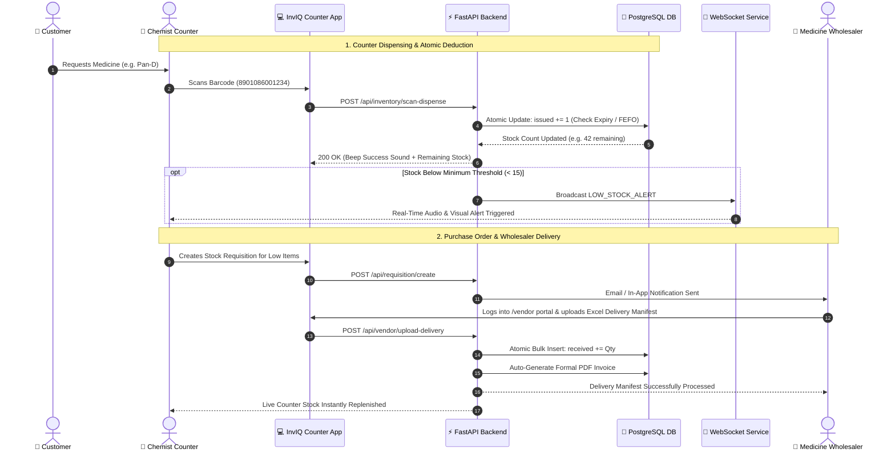
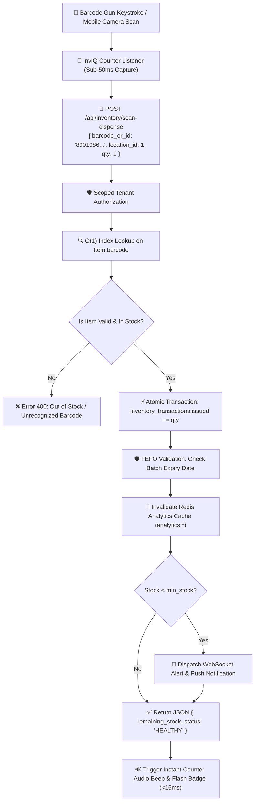
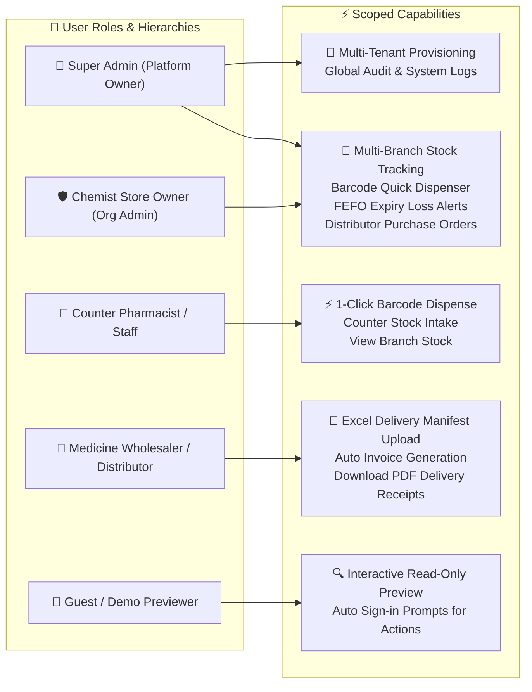

# 🏥 InvIQ - AI-Powered Retail Chemist & Multi-Pharmacy Inventory Operating System

**Smart AI inventory, FEFO expiry loss prevention, barcode quick-dispensing, and distributor Excel synchronization for retail medical stores and pharmacy chains.**

---

## 🎯 Problem It Solves

Independent retail medical stores and local pharmacy chains in Tier-2/3 cities lose significant revenue every month due to **expired medications (FEFO loss)**, missed customer sales from sudden stockouts, and manual paper-heavy distributor bills. **InvIQ provides a simple, ultra-fast, mobile-friendly platform tailored specifically for chemist shop owners:**

1. **Zero Expiry Loss (FEFO)**: Real-time alerts at 30, 60, and 90 days before batch expiration so chemists can return stock to distributors on time.
2. **Instant Barcode Quick Dispense**: Connected USB/Bluetooth barcode scanner and camera dispense endpoint that removes sold items one-by-one with millisecond consistency.
3. **1-Click Distributor Bill Ingest**: Upload wholesaler Excel/CSV delivery manifests to auto-increment live stock in seconds.
4. **Single & Multi-Shop Chains**: Centralized dashboard to track stock across 1 to 10+ shop counters from a phone or tablet.

---

## 🛠️ Tech Stack

### Backend


### Frontend


### AI & Barcode Infrastructure


---

## ✨ Key Capabilities

- ⚡ **Ultra-Fast Barcode Scanner Dispensing** - Instant 1-by-1 stock deduction on counter scan with zero latency.
- 📦 **FEFO Expiry Loss Shield** - Proactive batch alerts ensuring no expired medicine remains on shelves.
- 🚚 **Supplier & Distributor Management** - Direct vendor accounts for delivery manifest ingestion.
- 🤖 **AI Chemist Assistant** - Ask questions in plain English or Hindi: *"What medicines are running low in Counter 1?"*
- 📊 **Real-Time Clean Analytics** - Live stock count, critical shortages, cold-chain fridge monitor, and store-by-store breakdowns.
- 🔐 **Multi-Tenancy & Tenant Data Isolation** - Full organization scoping with clean RBAC (Admin, Vendor, Super Admin).


---

## 🚀 Quick Local Setup

### Prerequisites
- Python 3.11+
- Node.js 18+
- PostgreSQL (or Neon account)
- Redis (or Upstash account)

### Backend Setup

```bash
# Clone repository
git clone https://github.com/Sayandip05/InvIQ.git
cd InvIQ

# Create virtual environment
python -m venv venv
source venv/bin/activate  # On Windows: venv\Scripts\activate

# Install dependencies
pip install -r requirements.txt

# Configure environment
cp .env.example .env
# Edit .env with your database, Redis, and API keys

# Initialize database
cd backend
python -c "from app.infrastructure.database.connection import init_db; init_db()"

# Run development server
uvicorn app.main:app --reload --port 8000
```

### Frontend Setup

```bash
# Navigate to frontend
cd frontend

# Install dependencies
npm install

# Configure environment
cp .env.example .env
# Edit .env with backend API URL

# Run development server
npm run dev
```

### Docker Setup (Recommended)

```bash
# Copy environment file
cp .env.example .env
# Edit .env with your credentials

# Start all services
docker-compose up -d

# Access application
# Frontend:      http://localhost:5173
# Backend:       http://localhost:8000
# API Docs:      http://localhost:8000/docs
# GraphQL:       http://localhost:8000/graphql/analytics
```

---

## 🏗️ Future-Proof System Architecture

### 1. Full-Stack & Cloud Infrastructure Architecture



---

### 2. Retail Chemist & Distributor Supply Chain Lifecycle



---

### 3. High-Speed Barcode Quick-Dispense Engine



---

## 👥 Role-Based Access Control (RBAC) & User Journeys




---


---

## 🔷 GraphQL Analytics API

InvIQ uses a **REST + GraphQL hybrid** — the industry-standard pattern. REST handles all mutations (create/update/delete). GraphQL handles analytics reads with zero over-fetching.

**Endpoint:** `POST /graphql/analytics`  
**Playground (dev):** `GET /graphql/analytics`

### Available Queries

```graphql
# Dashboard chart data
{ dashboardStats {
    categoryDistribution { name value }
    lowStockItems { name stock minStock shortage }
    statusDistribution { name value color }
} }

# Full heatmap grid
{ heatmap { locations items matrix
    details { itemName currentStock healthStatus }
} }

# Stock alerts with filter
{ alerts(severity: "CRITICAL") {
    count alerts { itemName currentStock recommendedReorder }
} }

# Aggregate summary
{ summary {
    healthSummary { critical warning healthy }
    categories { name total critical }
} }

# Flexible ad-hoc query with server-side filters
{ stockHealth(location: "Warehouse", statusFilter: "CRITICAL") {
    itemName currentStock avgDailyUsage daysRemaining
} }
```

### Role-Aware Field Masking

| Caller | `avgDailyUsage` | `daysRemaining` | `leadTimeDays` |
|--------|:---:|:---:|:---:|
| Guest / Vendor | `null` | `null` | `null` |
| Manager / Admin / Super Admin | ✅ | ✅ | ✅ |

---

## 📚 Documentation

For detailed documentation, see the `/docs` folder:

- **[High-Level Design (HLD)](docs/HLD.md)** - System overview, architecture, tech stack decisions
- **[API Reference](docs/api.md)** - REST + GraphQL endpoint reference

---

## 🧪 Testing

```bash
# Run all tests (347 unit, integration, and security tests — 100% pass rate)
cd backend
pytest -v

# Run with coverage report
pytest --cov=app --cov-report=html

# Run specific test file
pytest tests/test_inventory_service.py -v
```


---

## 📦 Project Structure

```
InvIQ/
├── backend/
│   ├── app/
│   │   ├── api/
│   │   │   ├── routes/           # REST routes (analytics, auth, inventory…)
│   │   │   └── graphql/          # Strawberry GraphQL (types, context, resolvers, schema)
│   │   ├── application/          # Business logic services
│   │   ├── core/                 # Config, security, middleware
│   │   ├── domain/               # Business domain logic
│   │   └── infrastructure/       # Database, cache, vector store
│   └── tests/                    # Test suite
├── frontend/
│   ├── src/
│   │   ├── components/           # React components
│   │   ├── pages/                # Portal pages
│   │   ├── context/              # Auth & WebSocket context
│   │   └── utils/                # Helper functions
│   └── package.json
├── database/
│   ├── schema.sql                # Database schema
│   └── seed_data.py              # Sample data
├── docs/                         # Documentation
├── docker-compose.yml
└── README.md
```

---

## 🔐 Security Features

- **JWT Authentication** - Access (30min) + Refresh (7 days) tokens
- **Argon2 Password Hashing** - GPU-resistant algorithm
- **Rate Limiting** - 5-60 req/min based on endpoint sensitivity
- **Token Blacklist** - Logout invalidation with Redis
- **Login Lockout** - 5 attempts → 15 min lockout
- **Role-Based Access Control** - 5-tier role hierarchy with GraphQL field masking
- **Audit Logging** - All write operations tracked
- **Multi-Tenancy** - Organization-level data isolation

---

## 🤝 Contributing

Contributions are welcome! Please follow these steps:

1. Fork the repository
2. Create a feature branch (`git checkout -b feature/amazing-feature`)
3. Commit your changes (`git commit -m 'Add amazing feature'`)
4. Push to the branch (`git push origin feature/amazing-feature`)
5. Open a Pull Request

---

## 📄 License

This project is licensed under the MIT License - see the [LICENSE](LICENSE) file for details.

---

## 👨‍💻 Author

**Sayandip Bar**

[](http://www.linkedin.com/in/sayandipbar2005)
[](https://github.com/Sayandip05)
[](mailto:sayandip@inviq.io)

---

## 🙏 Acknowledgments

- **FastAPI** - Modern Python web framework
- **Strawberry GraphQL** - Code-first GraphQL for Python
- **LangChain/LangGraph** - AI agent orchestration
- **Groq** - Fast LLM inference
- **Neon** - Managed PostgreSQL
- **Upstash** - Serverless Redis
- **ChromaDB** - Vector database for RAG

---

## 📊 Project Stats


---

<div align="center">
  <p>Made with ❤️ for healthcare professionals</p>
  <p>⭐ Star this repo if you find it helpful!</p>
</div>
