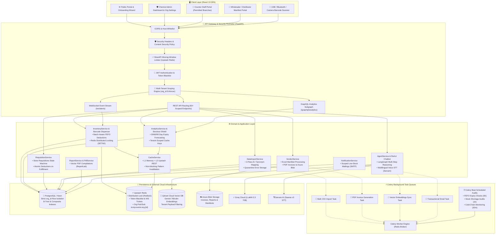
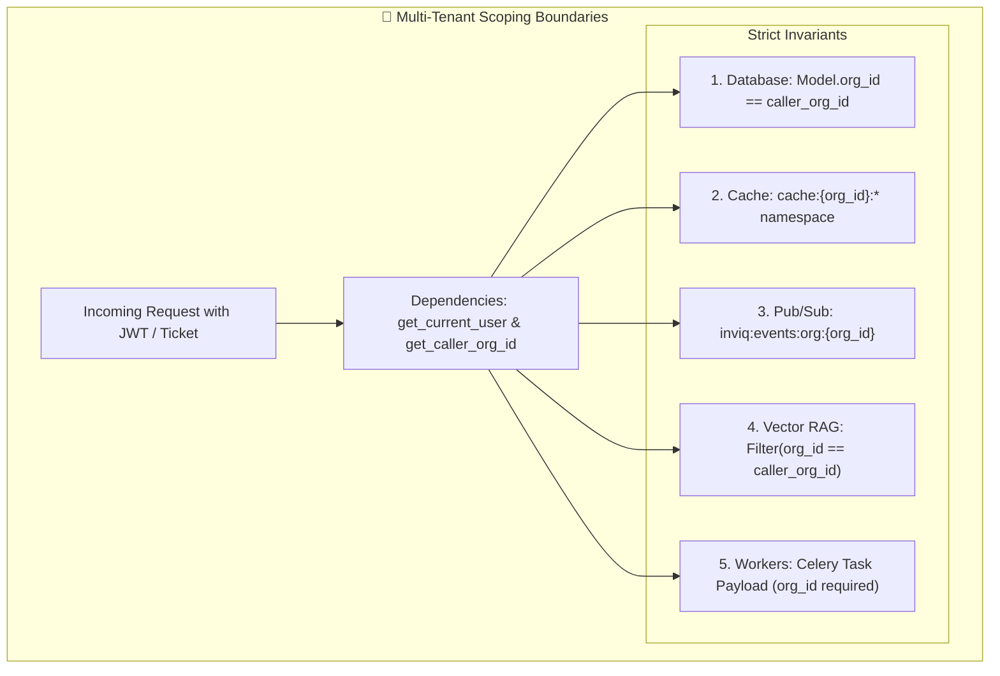
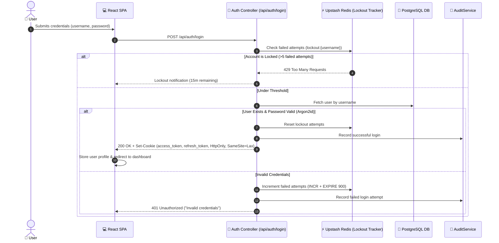
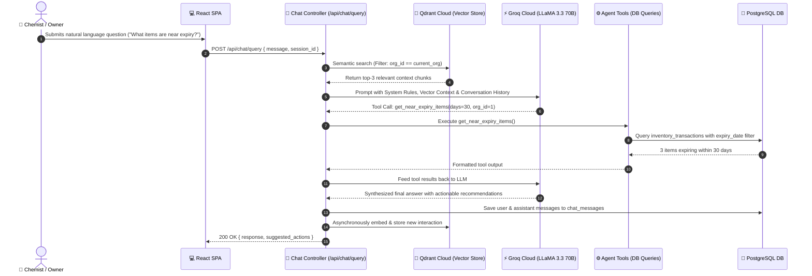
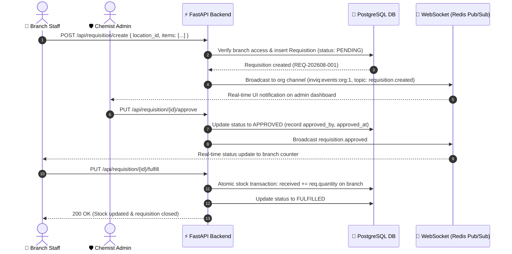
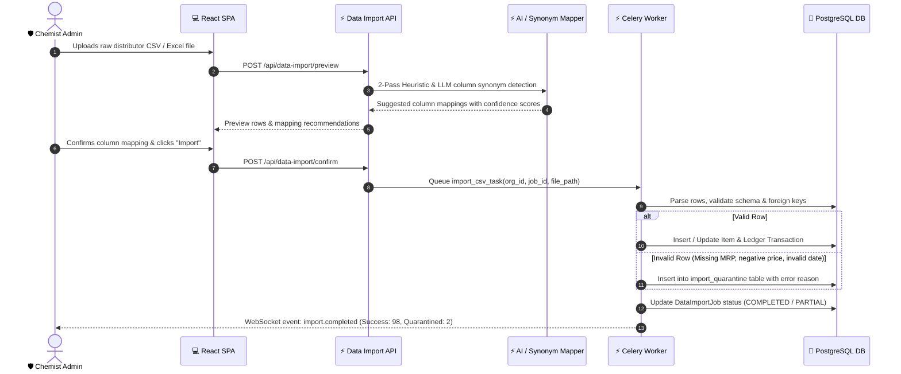
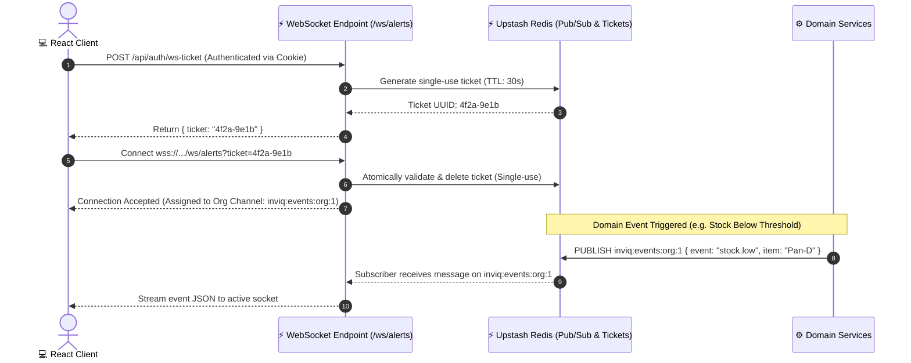
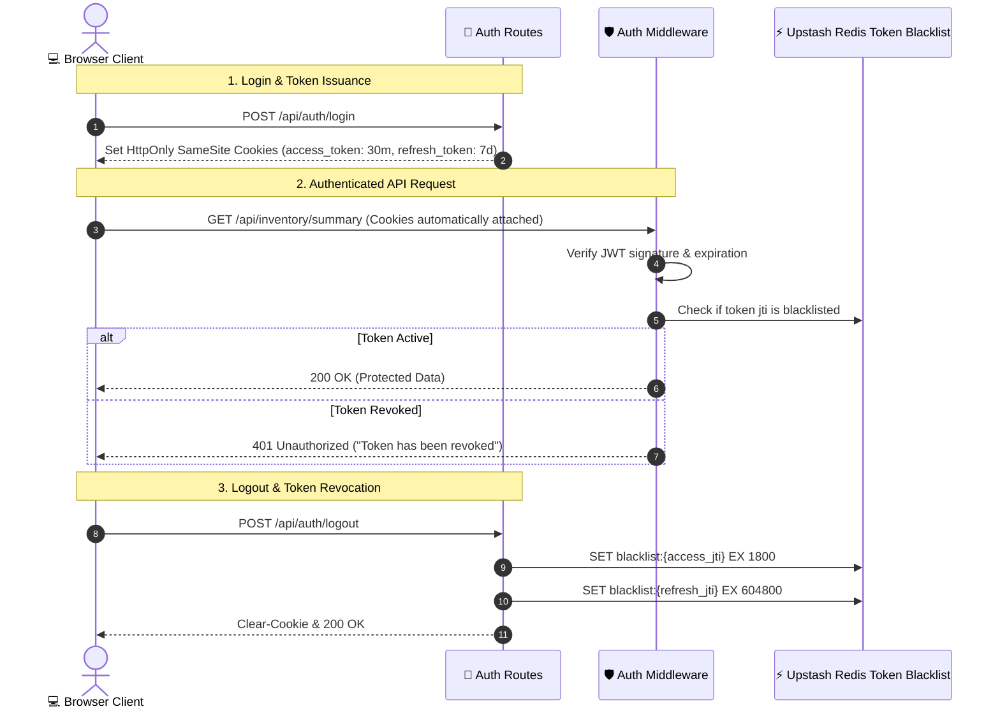
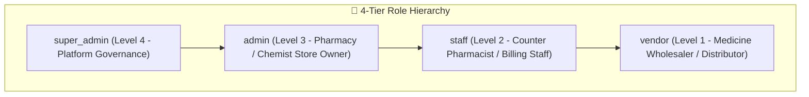

# High-Level Design (HLD) - InvIQ Retail Chemist & Multi-Pharmacy Operating System

**Version:** 6.0  
**Last Updated:** August 16, 2026  
**Author:** Sayandip Bar

---

## 1. Problem Statement

Independent retail chemist shops and local pharmacy chains in Tier-2/3 cities lose substantial profit margins due to **expired medications (FEFO loss)**, sudden customer stockouts, and tedious distributor billing. Chemist owners rely on outdated software or manual registers, lacking real-time visibility across branches or connected counter scanning. **InvIQ automates this inventory with FEFO expiry tracking, millisecond barcode quick-dispensing, distributor Excel synchronization, and natural language AI queries.**

---

## 2. Who Are the Users?

### Primary Users
- **Pharmacy & Chemist Store Owners (Admin)** - Own 1 to 5+ medical store counters; need live stock, zero expiry loss, and distributor oversight.
- **Medicine Distributors & Wholesalers (Vendors)** - Supply medicines and ingest delivery manifests via Excel/CSV.
- **Counter Pharmacists / Staff** - Use barcode scanners at billing counters for instantaneous 1-by-1 stock deduction.
- **Platform Super Admin** - Multi-tenant platform management and system governance.

### Pain Points Solved
- ❌ Medicine expiry on shelves → ✅ Proactive 30/60/90-day FEFO alerts for distributor returns
- ❌ Slow manual stock deduction → ✅ Millisecond Barcode / USB Scanner Quick Dispensing
- ❌ Fragmented distributor paper bills → ✅ 1-Click Excel delivery manifest ingestion
- ❌ Disconnected branch counters → ✅ Real-time multi-branch stock synchronization

---

## 3. System Overview

**InvIQ** is an AI-powered retail chemist and pharmacy inventory operating system that tracks medicine batches across pharmacy shops. It provides:

1. **Ultra-Fast Barcode Scanner Dispensing** - Instant 1-by-1 stock deduction on counter scan with zero latency.
2. **FEFO Expiry Loss Shield** - Proactive batch expiry tracking (30/60/90 days).
3. **Supplier / Distributor Management** - Direct vendor accounts for delivery manifest ingestion.
4. **Distributor Excel Ingestion** - Automatic live stock replenishment from wholesaler manifests.
5. **Real-Time Analytics & Unified Sticky Navbars** - Clean store breakdown, cold-chain fridge monitor, and critical shortage alerts.
6. **Multi-Tenancy & Tenant Data Isolation** - Scoped organization architecture supporting Single Pharmacy and Multiple Pharmacy tiers.


---

## 4. Scope

### ✅ In Scope
- Multi-location retail chemist & multi-pharmacy inventory tracking
- Instant 1-by-1 Barcode Quick Dispense (`/api/inventory/scan-dispense`)
- Proactive FEFO (First Expiry, First Out) 30/60/90-day expiry loss protection
- AI-powered natural language queries (English & Hindi voice via Sarvam AI)
- Requisition approval workflow & PO generation
- Wholesaler/Distributor Excel upload manifest integration & auto-generated PDF invoices
- Real-time stock alerts (WebSocket via Redis Pub/Sub) & Low-stock email alerts (SMTP)
- Role-based access control (4 roles: super_admin, admin, staff, vendor) + Guest Demo Mode
- Analytics dashboard with Upstash Redis caching & local in-memory fallback
- Multi-tenancy (organization isolation: Single Pharmacy & Multi-Pharmacy tiers)
- Audit logging for regulatory compliance
- Automated Celery Beat scheduled audits (FEFO, Stock shortage, Cold-Chain monitoring)


### ❌ Out of Scope
- Barcode/RFID scanning (future)
- Mobile app (web-responsive only)
- Automated reordering (manual approval required)
- Integration with ERP systems (future)
- Predictive analytics (ML models - future)
- Multi-language support (English only)
- Offline mode (requires internet)

---

## 5. System Architecture

### 5.1 Full-Stack Architecture Diagram



---

### 5.2 Multi-Tenant Data Isolation Architecture



### 5.3 Component Responsibilities

| Component | Responsibility |
|-----------|---------------|
| **React Frontend** | Single responsive SPA (Desktop Sidebar / Mobile Bottom Nav), 4 role-based views (Super Admin, Admin, Staff, Vendor) + Guest Demo Mode, real-time WebSocket updates |
| **FastAPI Backend** | REST API (60+ endpoints), JWT authentication, business logic orchestration |
| **Domain Layer** | Repository protocols (Protocol classes), value objects (StockStatus, StockThresholds, ReorderPolicy), domain calculations |
| **GraphQL Layer (Strawberry)** | Read-only analytics API at `/graphql/analytics` — 5 queries, role-aware field masking, shared Redis cache with REST |
| **AI Agent Service** | LangGraph ReAct agent with 9 tools, natural language processing, voice transcription (Sarvam AI) |
| **Analytics Service** | Dashboard stats, heatmaps, critical alerts with Redis caching & local in-memory fallback |
| **Inventory Service** | High-speed barcode dispense, stock tracking, transaction management, reorder calculations, WebSocket alert triggers |
| **Requisition Service** | Approval workflow, status management, inventory updates |
| **Vendor Service** | Excel delivery manifest parsing, item matching, bulk transaction creation, auto-invoicing |
| **Celery Worker & Beat** | Scheduled background audits: FEFO expiry (every 6h), stock shortage (hourly), cold-chain monitor (every 30m) |
| **PostgreSQL** | Primary multi-tenant relational store (13 tables, DB Enums, composite indexes, Alembic migrations) |
| **Upstash Redis** | Distributed cache, Pub/Sub alert broker, token blacklist, login attempt tracking |
| **Qdrant Cloud** | Vector database for AI semantic memory and RAG context |


---

## 6. Detailed Request/Response Flows

### 6.1 User Authentication & Cookie Session Flow



### 6.2 AI Chatbot Query & RAG Memory Flow



### 6.3 Requisition Lifecycle Flow (`PENDING` → `APPROVED` → `FULFILLED`)



### 6.4 Data Import & Quarantine Error Flow



### 6.5 Real-Time WebSocket & Redis Pub/Sub Flow



---

## 7. Authentication & Authorization Architecture

### 7.1 JWT & Cookie Lifecycle



### 7.2 4-Tier Role Hierarchy & Permissions Matrix



| Permission / Capability | `super_admin` | `admin` | `staff` | `vendor` |
|:---|:---:|:---:|:---:|:---:|
| **Multi-Tenant Org Creation & Provisioning** | ✅ | ❌ | ❌ | ❌ |
| **Pharmacy Settings & Branch Location Config** | ✅ | ✅ | ❌ | ❌ |
| **Staff & Supplier Account Management** | ✅ | ✅ | ❌ | ❌ |
| **Requisition Approvals & Rejections** | ✅ | ✅ | ❌ | ❌ |
| **Barcode Quick Dispense (`/scan-dispense`)** | ✅ | ✅ | ✅ (Assigned Branch) | ❌ |
| **Create Stock Requisitions** | ✅ | ✅ | ✅ (Assigned Branch) | ❌ |
| **Upload Wholesaler Excel Delivery Manifests** | ✅ | ✅ | ❌ | ✅ (Assigned Locations) |
| **Download PDF Delivery Invoices** | ✅ | ✅ | ❌ | ✅ (Own Invoices) |
| **View Audit Trail & System Security Logs** | ✅ | ✅ (Own Org) | ❌ | ❌ |

### 7.3 Multi-Tenancy Isolation Invariants

InvIQ enforces non-negotiable multi-tenant boundaries at every architectural layer:

1. **Database Tier**: Every tenant-owned table (`locations`, `items`, `inventory_transactions`, `requisitions`, `requisition_items`, `vendor_uploads`, `vendor_invoices`, `data_import_jobs`, `import_quarantine`, `chat_sessions`, `chat_messages`, `audit_logs`) has a non-nullable `org_id` column with composite B-Tree indexes (`(org_id, id)`, `(org_id, item_id, location_id)`).
2. **Context Resolution**: Routes resolve tenant identity via `current_user.org_id` (`get_caller_org_id` / `get_current_user`). If a non-superadmin user has `org_id is None`, all operations are strictly rejected (`403 Forbidden`).
3. **No Cross-Tenant Leaks**: Any attempt to read or mutate another tenant's resource returns `404 Not Found` or `403 Forbidden` without revealing whether the resource exists.
4. **Cache & Pub/Sub Isolation**: Redis cache keys (`cache:{org_id}:*`) and Pub/Sub event channels (`inviq:events:org:{org_id}`) are partitioned per tenant.
5. **Vector RAG Isolation**: Qdrant semantic searches apply metadata payload filtering (`Filter(must=[FieldCondition(key="org_id", match=MatchValue(value=org_id))])`) to guarantee that conversation memory and AI retrieval never cross tenant boundaries.

---


## 8. Tech Stack & Characteristics

### 8.1 Tech Stack Choices

#### Backend
| Technology | Why Chosen |
|------------|-----------|
| **FastAPI** | Async support, automatic OpenAPI docs, fast performance, Python ecosystem |
| **Strawberry GraphQL** | Code-first GraphQL for Python — integrates natively with FastAPI, supports role-aware resolvers and field-level nullable masking |
| **PostgreSQL** | ACID compliance, complex queries, JSON support, production-ready |
| **Alembic** | Database migration management for production-safe schema changes |
| **Upstash Redis** | Serverless Redis, REST API (no TCP), pay-per-request, global replication |
| **Qdrant Cloud** | Vector database for semantic search and RAG context storage |
| **LangGraph** | Orchestrates ReAct agent workflows and structures tool execution state machines |
| **Groq** | Ultra-fast LLM inference (LLaMA 3.3 70B), cost-effective |
| **Pydantic Settings** | Type-safe configuration management with `.env` file support and production validation |
| **Argon2 (pwdlib)** | GPU-resistant, memory-hard password hashing (PHC winner) |

#### Frontend
| Technology | Why Chosen |
|------------|-----------|
| **React 19** | Modern UI capabilities, component reusability, large ecosystem |
| **Vite** | Fast hot-reloading (HMR) and optimized build times |
| **Tailwind CSS** | Rapid and consistent responsive styling |
| **Recharts** | Fully interactive charts tailored for analytics dashboards |

#### Infrastructure
| Technology | Why Chosen |
|------------|-----------|
| **Neon** | Serverless PostgreSQL with auto-scaling, instant branching, and automatic backups |
| **Render.com** | Zero-downtime deployment, health checks, automatic SSL |
| **Docker** | Standardized, isolated container environments for local dev and testing |

### 8.2 System Characteristics

| Characteristic | Value | Notes |
|----------------|-------|-------|
| **Architecture** | Clean Architecture (Domain/Application/Infrastructure/API) | Modular monolith with DDD-inspired layering |
| **API Style** | REST + GraphQL + WebSocket | 56+ REST endpoints, 5 GraphQL queries, WebSocket alerts |
| **Database** | PostgreSQL (ACID) | 11 tables, Alembic migrations, connection retry with backoff |
| **Caching** | Redis (Upstash) | 2-5 min TTL, SCAN-based invalidation, shared between REST and GraphQL |
| **AI** | LangGraph ReAct | 9 tools, 30s timeout, voice STT (Sarvam AI, 22 languages) |
| **Auth** | JWT (HS256) + Argon2 | 30 min access, 7 days refresh, token rotation, timing-safe verification |
| **Rate Limiting** | slowapi (moving-window) | 5-60 req/min, Redis-backed (REST only) |
| **Real-time** | WebSocket | Location-based broadcasting, ping/pong heartbeat |
| **Deployment** | Docker multi-stage → Azure/Render | CI/CD via GitHub Actions |
| **Scaling** | Vertical | Add RAM/CPU to single instance |
| **Background Jobs** | Daemon Threads | In-process email dispatch |
| **Config** | Pydantic Settings v2 | Type-safe, multi-path .env, production validation |
| **External APIs** | Groq, LangSmith, Sarvam AI, Qdrant | LLM inference, observability, voice STT, vector storage |

### 8.3 External Integrations
- **Groq API:** Handles LLM inference for chatbot queries using `llama-3.3-70b-versatile`.
- **LangSmith:** Monitors chain execution and traces tool performance.
- **Sarvam AI:** Voice-to-text transcription (`saaras:v3`) supporting 22 Indian languages.
- **Qdrant Cloud:** Vector storage for chat memory and RAG context.
- **SMTP Server:** Dispatches automated emails for password resets, invites, and critical stock notifications.
- **Google OAuth:** Validates external credentials to log in social users.

---

## 9. Architectural Decisions

### 9.1 Why Modular Monolith Over Microservices?
- **Team Size:** A single developer maintains the system. Building and managing microservices would introduce substantial operational overhead (network overhead, service discovery, pipeline management).
- **Domain Coupling:** Inventory tracking, requisitions, and analytics are tightly coupled. Extracting services prematurely would necessitate distributed transactions (Sagas) and complicate data consistency.
- **Deployment Simplicity:** A single Render instance runs the server, avoiding multi-container orchestrations.
- **Cost:** Keeps infrastructure footprints low (single PostgreSQL pool, single cache pool).
- **Performance:** In-process function execution runs in nanoseconds, eliminating HTTP serialization latency between sub-modules.
- **Modular Boundaries:** Designed with clean separation to ease extraction to microservices if scaling demands dictate:
  ```
  backend/app/
  ├── api/              # API routes, Pydantic schemas, GraphQL
  ├── application/      # Service orchestration (inventory, requisition, agent, analytics, report)
  ├── domain/           # Core business rules, value objects, repository protocols
  └── infrastructure/   # Persistence, caching, database, vector store
  ```

### 9.2 Background Jobs & Task Queues
- **Decision:** **Lightweight Async Dispatch (In-Process Daemon Threads)**
- **Rationale:** External brokers like Celery/RabbitMQ are bypassed to avoid high infrastructure costs and deployment complexity. For SMTP operations (which block for 1–3 seconds), Python's `threading.Thread(daemon=True)` executes tasks asynchronously.
- **Error Handling:** Outages on the mail server or integrations log warnings in the background but do not affect or roll back database transactions.
- **Scale Plan:** If alert volumes scale to thousands per minute, a Redis-backed lightweight queue like **ARQ** or **Celery** will replace the thread executor to ensure persistence across container restarts.

### 9.3 Security Architecture Decisions

#### 9.3.1 Password Hashing: Argon2
Winner of the Password Hashing Competition (PHC). GPU-resistant and memory-hard, protecting users from dictionary attacks better than legacy algorithms (bcrypt, PBKDF2).

#### 9.3.2 Token Blacklist & Rate Limiting
A Redis cache registers blacklisted JWT access tokens upon logout. Endpoints use `slowapi` to impose strict request throttling (5/min for auth, 20/min for AI queries) to counter brute-force attempts and control LLM compute costs.

#### 9.3.3 Database-level Multi-Tenancy
Queries dynamically filter by `org_id` in the database query layer rather than application-level logic. This limits security drift risks compared to memory-based filters.

---

## 10. Deployment Architecture

### Local Development (Docker Compose)

```
┌─────────────────────────────────────────────────────────────────┐
│                     LOCAL DEVELOPMENT                            │
├─────────────────────────────────────────────────────────────────┤
│                                                                  │
│  docker compose up --build                                       │
│                                                                  │
│  ┌──────────────────────┐  ┌──────────────────────────────────┐ │
│  │  FastAPI Container    │  │  Cloud Services (external)       │ │
│  │  - Port 8000          │──│  - Neon PostgreSQL               │ │
│  │  - Gunicorn + Uvicorn │  │  - Upstash Redis                │ │
│  │  - 3 workers          │  │  - Qdrant Cloud                 │ │
│  │  - Health check       │  │  - Groq API                     │ │
│  └──────────────────────┘  └──────────────────────────────────┘ │
│                                                                  │
└─────────────────────────────────────────────────────────────────┘
```

### Production (Azure Container Instance)

```
┌─────────────────────────────────────────────────────────────────┐
│                         PRODUCTION                               │
├─────────────────────────────────────────────────────────────────┤
│                                                                  │
│  Frontend (Vercel)                                              │
│  - React SPA                                                    │
│  - CDN distribution                                             │
│  - Auto-deploy from GitHub                                      │
│                                                                  │
│  Backend (Azure Container Instance)                              │
│  - Docker multi-stage build                                     │
│  - ACR: inviqacr.azurecr.io                                     │
│  - 2 CPU / 4 GB RAM                                             │
│  - Auto-deploy via GitHub Actions CI/CD                          │
│  - Health checks on /health                                     │
│                                                                  │
│  Database (Neon PostgreSQL)                                      │
│  - Managed PostgreSQL                                           │
│  - Alembic migrations on startup                                │
│  - Automatic backups                                            │
│                                                                  │
│  Cache (Upstash Redis)                                          │
│  - Serverless Redis                                             │
│  - Global replication                                           │
│                                                                  │
│  Vector DB (Qdrant Cloud)                                       │
│  - Managed vector storage                                       │
│  - Semantic search for AI chatbot                                │
│                                                                  │
└─────────────────────────────────────────────────────────────────┘
```

### CI/CD Pipeline

```
git push main
    ↓
CI: pytest + docker build (GitHub Actions)
    ↓
CD: build image → push to ACR → deploy to Azure
    ↓
Live at http://inviq-api.eastasia.azurecontainer.io:8000
```

### Docker Multi-Stage Build

```
Stage 1 (Builder):
  python:3.11-slim
  - Install system deps (gcc, libpq-dev, libffi-dev)
  - Create virtual environment
  - Install CPU-only PyTorch (~200 MB vs 2 GB CUDA)
  - Install all Python dependencies

Stage 2 (Runner):
  python:3.11-slim
  - Copy venv from builder
  - Copy application code
  - Health check via curl
  - CMD: alembic upgrade head → gunicorn (3 workers)
```

---

## 11. Key Design Patterns

| Pattern | Where Used | Why |
|---------|-----------|-----|
| **Clean Architecture** | `backend/app/` — Domain/Application/Infrastructure/API layers | Enforces dependency rule: domain has zero infrastructure imports |
| **Repository Protocol** | `app/domain/interfaces.py` | Structural subtyping via `typing.Protocol` — services depend on contracts, not implementations |
| **Dependency Injection** | FastAPI `Depends()` in `app/core/dependencies.py` | Promotes loose coupling, facilitates unit testing through mock dependencies |
| **Service Layer** | `app/application/` services | Isolates transactional orchestrations from routing logic |
| **Value Objects** | `app/domain/value_objects.py` — StockStatus, StockThresholds, ReorderPolicy | Immutable, behaviour-rich types encoding business rules |
| **ReAct Agent** | Chat system (`agent_service`) | LLM reasoning-action loop with 9 inventory tools |
| **CQRS (Light)** | Dashboard analytics — REST + GraphQL reads separated from writes | Isolates write operations from read-heavy analytics |
| **Event-driven** | WebSocket modules | Pushes live notifications to active frontends without polling |
| **Role-aware Resolvers** | GraphQL analytics layer | Field-level null masking enforces RBAC at the data layer |
| **Read-only Session Guard** | `agent_tools.py` — `ReadOnlySession` | Prevents AI agent from modifying database during tool execution |

---

## 12. Non-Functional Requirements

| Requirement | Target | Implementation |
|-------------|--------|----------------|
| **Availability** | 99.5% uptime | Health checks, database retry with exponential backoff (3 attempts), Redis graceful fallback, Alembic migrations |
| **Performance** | < 200ms API response | Redis caching (2-5 min TTL), database indexing, connection pooling (5-10), N+1 query prevention |
| **Scalability** | 100 concurrent users | Stateless backend, async FastAPI, connection pool sizing, moving-window rate limiting |
| **Security** | OWASP Top 10 compliance | Argon2 hashing, JWT type enforcement + blacklisting, RBAC (6 tiers), timing-safe auth, PII masking, rate limiting |
| **Data Integrity** | Zero data loss | PostgreSQL ACID transactions, foreign key constraints, atomic requisition approval, Alembic migrations |
| **Observability** | Full execution tracing | Structured JSON logging, unique `X-Request-ID` headers, optional LangSmith tracing |
| **Config Safety** | Production validation | Pydantic Settings with `@model_validator` — blocks startup on insecure SECRET_KEY in production |

---

## 13. Scalability & Data Flow Patterns

### 13.1 Data Flow Patterns

#### Read-Heavy (Analytics — REST)
```
Request → Check Redis cache → If miss, query DB → Cache result → Return
```

#### Read-Heavy (Analytics — GraphQL)
```
Request → JWT optional auth → Check Redis (shared keys) → If miss, call AnalyticsService
       → Apply role-aware field masking → Return typed Strawberry objects
```

#### Write-Heavy (Inventory Transactions)
```
Request → Validate → Write to DB → Invalidate cache (analytics:*) → Audit log → WebSocket broadcast
```

#### AI Query (RAG)
```
Request → Load history → Query vector DB → Build context → LLM inference → Save response
```

#### Real-time (WebSocket)
```
Event → WebSocket manager → Broadcast to location → All clients receive
```

### 13.2 Scalability Considerations
- **Neon PG Limits:** Free tier constraints (~500MB DB capacity, 20 max pool connections). Vertical scale triggers are defined when telemetry indicators show connection exhausts.
- **WebSocket Broadcasting:** Single-instance dependent. To expand horizontally, a Redis Pub/Sub adapter will distribute messages to WebSocket listeners across cluster nodes.
- **LLM Rate Throttling:** Groq limits LLM throughput. Production mitigations involve queuing, failover LLMs (e.g. Gemini, OpenAI), and aggressive semantic caching of common questions.

---

## 14. Future Enhancements

### Phase 2 (Next 6 months)
- Barcode scanning integration (mobile camera parsing)
- Predictive analytics (ML models for demand forecasting)
- Mobile app (React Native port)
- Automated reordering based on thresholds
- Integration with hospital ERP systems

### Phase 3 (Next 12 months)
- Multi-language support
- Advanced reporting (custom dashboards)
- Supplier management portal
- Batch/lot tracking for compliance
- Expiry date management

---

## 15. Success Metrics

| Metric | Target | Current |
|--------|--------|---------|
| **User Adoption** | 80% of staff using daily | TBD |
| **Stockout Reduction** | 50% fewer critical stockouts | TBD |
| **Time Saved** | 10 hours/week per manager | TBD |
| **AI Accuracy** | 90% correct answers | TBD |
| **System Uptime** | 99.5% | TBD |
| **Response Time** | < 200ms (p95) | TBD |

---

**Document Status:** ✅ Complete  
**Last Reviewed:** July 24, 2026  
**Next Review:** Every 3 months
